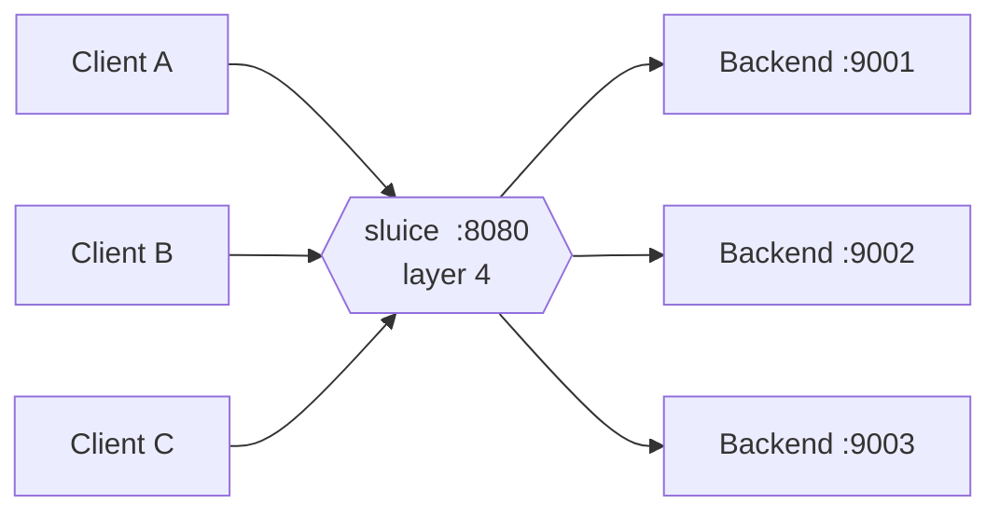

# sluice

> A layer 4 (TCP) load balancer written from scratch in Go.

**Status:** work in progress. Built for fun and for learning — no production claims here.

---

## What is a layer 4 load balancer?

A load balancer sits between clients and a pool of backend servers and decides which
backend serves each incoming connection. The "layer 4" part refers to the transport
layer of the OSI model: TCP and UDP.

That single detail is what defines the whole thing. An L4 balancer routes traffic by
looking at the connection's 5-tuple — source IP, source port, destination IP,
destination port, protocol — and nothing else. It never parses the payload. It does not
know about HTTP methods, URL paths, headers or cookies. From its point of view a
connection is an opaque stream of bytes to be shuffled from one socket to another.



Once a connection is assigned to a backend, every byte of that connection keeps going to
the same backend until it closes. This is connection affinity, and it comes for free at
L4: the balancer is forwarding a stream, not individual requests.

```
        ┌──────────┐        ┌──────────┐        ┌──────────┐
 client │   TCP    │───────▶│  sluice  │───────▶│   TCP    │ backend
        │ conn #1  │        │          │        │ conn #1' │
        └──────────┘        │  pick a  │        └──────────┘
        ┌──────────┐        │  backend │        ┌──────────┐
 client │   TCP    │───────▶│  + splice│───────▶│   TCP    │ backend
        │ conn #2  │        │   bytes  │        │ conn #2' │
        └──────────┘        └──────────┘        └──────────┘

         two independent TCP connections, glued together
```

## L4 vs L7

| | Layer 4 | Layer 7 |
|---|---|---|
| Sees | IP + port, raw bytes | Full application message (e.g. HTTP) |
| Routes by | 5-tuple, hashing, counters | Path, host, headers, method |
| Unit of work | Connection | Request |
| Protocol support | Anything over TCP/UDP | One protocol at a time |
| Cost per byte | Very low | Parsing, buffering, reassembly |

An L4 balancer is protocol agnostic, so the same binary can front Postgres, Redis, gRPC,
SMTP or plain HTTP without knowing the difference. The trade-off is that it cannot make
any decision that requires understanding the conversation: no path-based routing, no
header rewriting, no per-request retries, no response caching. If a backend accepts the
TCP handshake but then answers garbage, an L4 balancer will happily keep sending traffic
its way unless health checking says otherwise.

## Concepts this project touches

- Balancing strategies: round robin, weighted round robin, least connections, source-IP hashing
- Health checking: passive (observe failures) vs active (probe backends)
- Connection draining when a backend is removed from the pool
- Backpressure, timeouts and half-closed connections
- Graceful shutdown and hot config reload
- Observability: connection counts, bytes in/out, backend latency

## Roadmap

- [ ] Accept TCP connections and forward to a single static backend
- [ ] Backend pool with round robin
- [ ] Additional balancing strategies
- [ ] Active health checks
- [ ] Configuration file
- [ ] Graceful shutdown and connection draining
- [ ] Metrics
- [ ] UDP support

## Build and run

```sh
go build ./...
```

_Usage instructions will land here once there is something to run._

## License

MIT
